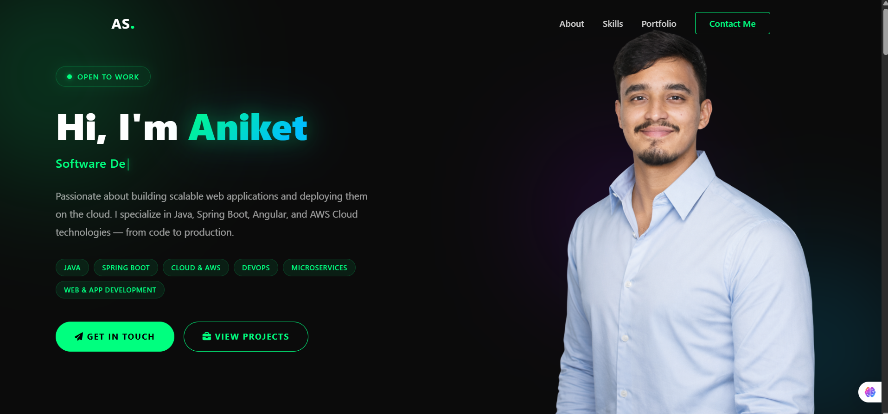

<h1 align="center">👋 Hey there, I'm Aniket Sahu</h1>
<h3 align="center">Java Full Stack Developer | DevOps Engineer | AWS Cloud Engineer</h3>

<p align="center">
  <a href="https://aniketsahu19.netlify.app" target="_blank">
    
  </a>
</p>

<p align="center">
  
  
  
  
  
  
</p>

---

## 🖥️ Live Demo

🔗 **[https://aniketsahu19.netlify.app](https://aniketsahu19.netlify.app)**

> Deployed via Netlify with CI/CD — every push to `main` triggers an automatic build and deployment.

---

## 📸 Preview



---

## ✨ Features

| Feature | Description |
|---|---|
| 🎯 **Hero Section** | Typewriter animation with dynamic role display |
| 👤 **About Me** | Personal intro with AWS certifications highlighted |
| 🛠️ **Skills Section** | Categorized tech stack with animated skill cards |
| 📂 **Portfolio Projects** | Glassmorphism project cards with live demo & code links |
| 📩 **Contact Form** | EmailJS-powered form with real-time validation |
| 📄 **Download Resume** | One-click resume download |
| 🏆 **Download Certificates** | Popup to download AWS certifications individually |
| 📱 **Fully Responsive** | Optimized for mobile, tablet, laptop, and desktop |
| ⚡ **CI/CD Pipeline** | Auto-deployed via Netlify on every GitHub push |

---

## 🧱 Tech Stack

### Frontend
- **[Angular](https://angular.io/)** — Component-based SPA framework
- **TypeScript** — Strongly typed JavaScript
- **HTML5 / SCSS** — Semantic markup and modern styling
- **Angular Reactive Forms** — Form handling and validation

### Libraries & Tools
- **[EmailJS](https://www.emailjs.com/)** — Contact form email delivery
- **[SweetAlert2](https://sweetalert2.github.io/)** — Beautiful alert dialogs
- **Font Awesome** — Icon library
- **[Netlify](https://www.netlify.com/)** — Hosting + CI/CD
- **GitHub** — Source control
- **npm** — Package management

---

## 🚀 CI/CD Deployment

This project uses a fully automated **CI/CD pipeline** via Netlify:

```
Developer → git push → GitHub → Netlify Build → Live Website
```

1. Code is pushed to the `main` branch on GitHub
2. Netlify detects the push and triggers a new build automatically
3. Angular app is compiled with `ng build`
4. Output is deployed to the Netlify CDN globally
5. Live site is updated — **zero manual steps required**

---

## 🛠️ Run Locally

### Prerequisites
- Node.js ≥ 18
- npm ≥ 9
- Angular CLI

### Steps

```bash
# 1. Clone the repository
git clone https://github.com/YOUR_GITHUB_USERNAME/portfolio.git

# 2. Navigate into the project
cd portfolio

# 3. Install dependencies
npm install

# 4. Start the development server
npm start
```

Open your browser at **[http://localhost:4200](http://localhost:4200)**

---

## 📦 Build for Production

```bash
npm run build
```

The production-ready output will be in the `/dist` folder.

---

## 📁 Folder Structure

```
portfolio/
├── src/
│   ├── app/
│   │   ├── components/
│   │   │   ├── navbar/        # Sticky navbar with hamburger menu
│   │   │   ├── hero/          # Hero section with typewriter effect
│   │   │   ├── about/         # About Me + stats + certificates
│   │   │   ├── skills/        # Categorized skills grid
│   │   │   ├── portfolio/     # Project showcase cards
│   │   │   ├── contact/       # Contact form + quick contact
│   │   │   └── footer/        # Footer with scroll-to-top
│   │   └── app.component.*    # Root component
│   ├── assets/                # Images, resume, icons
│   └── styles.scss            # Global styles and variables
├── angular.json               # Angular CLI configuration
├── package.json               # Project dependencies
└── README.md
```
---

## 📄 License

This project is licensed under the **MIT License**.

```
MIT License

Copyright (c) 2025 Aniket Sahu

Permission is hereby granted, free of charge, to any person obtaining a copy
of this software and associated documentation files (the "Software"), to deal
in the Software without restriction, including without limitation the rights
to use, copy, modify, merge, publish, distribute, sublicense, and/or sell
copies of the Software, and to permit persons to whom the Software is
furnished to do so, subject to the following conditions:

The above copyright notice and this permission notice shall be included in all
copies or substantial portions of the Software.

THE SOFTWARE IS PROVIDED "AS IS", WITHOUT WARRANTY OF ANY KIND, EXPRESS OR
IMPLIED, INCLUDING BUT NOT LIMITED TO THE WARRANTIES OF MERCHANTABILITY,
FITNESS FOR A PARTICULAR PURPOSE AND NONINFRINGEMENT.
```

---

<p align="center">
  Made with ❤️ by <strong>Aniket Sahu</strong> &nbsp;|&nbsp; ⭐ Star this repo if you like it!
</p>
